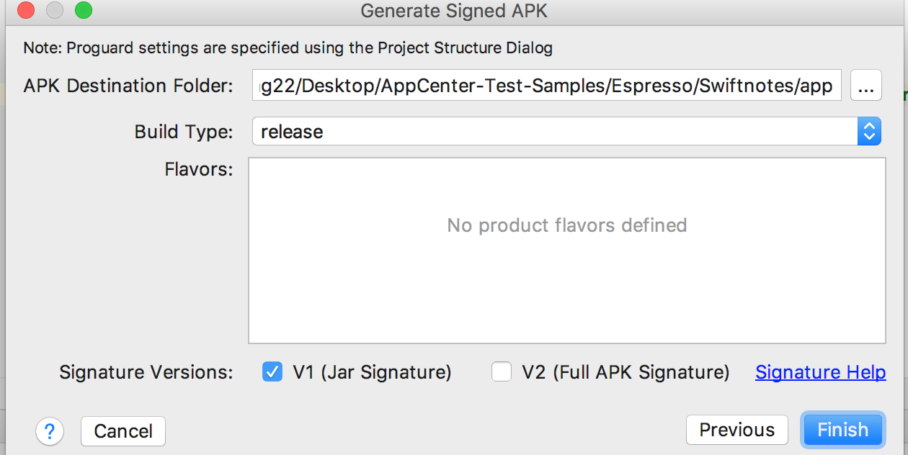

# Espresso App and Test Signing for App Center Test
To execute Espresso tests in App Center Test, the app APK and the test APK must be signed the same way. They must both be signed using: 

    - the same V1 (Jar signature) OR 
    - the same V1 (Jar Signature) plus the same V2 (Full APK Signature).
    
APKs signed with only a V2 (Full APK Signature) won't pass App Center Test validation and won't be executed. Tests for APKs signed differently than each other will fail at runtime.

## Background
When Espresso tests execute, the test code runs in process with your app and it's an Android security requirement that they be signed the same.

For compatibility with older devices, Android recommends & App Center Test requires that APKs contain a v1 signature: 
"Older Android platforms ignore v2+ signatures and thus need apps to contain v1 signatures."  See [Android Application Signing](https://source.android.com/security/apksigning/).

## Release Builds
To upload Espresso tests with the release build of your app to App Center Test, it's mandatory to sign the application APK in release mode.

See Signing Your Applications in Android Developers Portal to understand how Android applications are signed. When generating a signed APK in Android Studio, it provides two Signature Version options:

    - V1 (Jar Signature) 
    - V2 (Full APKSignature)

App Center Test accepts APK files signed with Scheme V1 (Jar Signature), however it doesn't accept APK files only signed with the V2 (Full APK Signature) option. One can also check both the checkboxes while signing the APK. 

To run Espresso tests locally or in App Center Test, it's mandatory to sign the test APK using the same signature as the application APK.