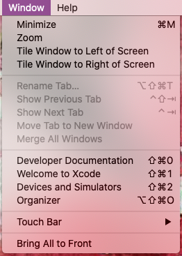
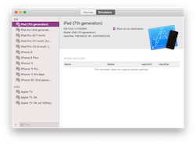

# Local testing with iOS Simulators
#### [Visual Studio](#tab/vswin/)
It isn't possible to run local iOS tests on Windows. 

#### [Visual Studio for Mac](#tab/vsmac/)
This guide will discuss how to specify an iOS simulator when running tests locally on macOS.

Each iOS simulator that's configured on an Apple device will have a unique *device identifier* assigned to it. UITest will use this device identifier to start the intended iOS simulator.

A UITest must use the `IApp.DeviceIdentifier` method to provide the device identifier:

```csharp
IApp app = ConfigureApp.iOS.AppBundle("/path/to/iosapp.app")
    .DeviceIdentifier("DEVICE_ID_OF_SIMULATOR")
    .StartApp();
```

## Identifying Available Simulators
There are two ways to list the simulators and their device identifiers:

1. The first way to identify available simulators is to start up Terminal and type `xcrun instruments -s devices`. The following output will display a list of known devices:

   ```bash
   $ xcrun instruments -s devices
   Known Devices:
   bushmaster [5A4B28A1-392A-59FB-81C5-137E881D61E9]
   Resizable iPad (8.1 Simulator) [B3BF8A06-2938-4B74-BF87-16C223F8690C]
   Resizable iPhone (8.1 Simulator) [E712409B-CFCC-409A-8162-627B6254EB3C]
   iPad 2 (7.1 Simulator) [E8572F8F-227B-4DB0-8C92-590DC770360D]
   iPad 2 (8.1 Simulator) [1F425263-3F96-4DAB-B843-0D041C3C71EA]
   iPad Air (7.1 Simulator) [2863AFF6-D9FC-45E8-8385-E2A548F19002]
   iPad Air (8.1 Simulator) [BBCF5CF2-20A4-4C47-9FA5-EBFF7311B071]
   iPad Retina (7.1 Simulator) [B7CBB024-E1D3-4B24-8C20-3E9F7B54CF61]
   iPad Retina (8.1 Simulator) [3E21ECD3-397A-4251-AEB6-2ADCF29AEE89]
   iPhone 4s (7.1 Simulator) [D36354DD-D6A3-4E08-A25B-276620D844B8]
   iPhone 4s (8.1 Simulator) [5C8FE602-8BA7-494D-A113-66C8B9AB3CB7]
   iPhone 5 (7.1 Simulator) [C696E83D-F9FE-4DBC-8C67-FA0FC533246E]
   iPhone 5 (8.1 Simulator) [9A8A5D92-A7D9-4A3C-81AA-97A9924F7D09]
   iPhone 5s (7.1 Simulator) [6CDF5B5C-A315-4A8C-9D38-29437FE59C6D]
   iPhone 5s (8.1 Simulator) [3F1C286F-3D5D-47B2-92B8-66B673BD0236]
   iPhone 6 (8.1 Simulator) [995FF713-9DE4-460B-800E-F5A20FD93AA7]
   iPhone 6 Plus (8.1 Simulator) [AB1C20F6-BFFC-4C80-879C-F19A7E3F0B5C]
   ```

2. Xcode provides another way to obtain a list of devices and their device identifiers. Once Xcode is running, select **Window > Devices and Simulators**:

]

Xcode will present a window showing attached devices. Select `Simulators` in the window to see installed simulators. When a simulator is selected the device identifier can be seen in the right-hand side of the window:

[ ](../images/ios-simulator-02.png#lightbox)

* * *