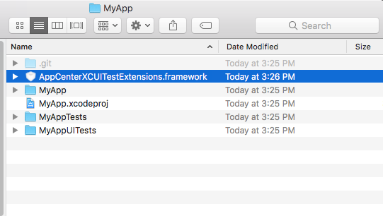
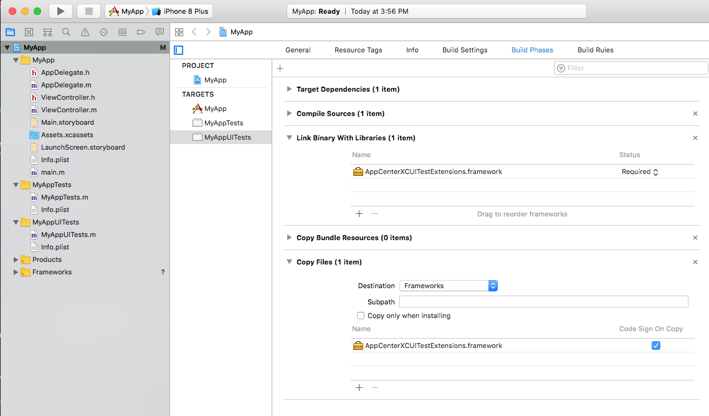

# Preparing XCUITest Tests for Upload with App Center Extensions Framework

> [!WARNING]
> This framework has been *deprecated* & is *no longer required* for running XCUITest tests in App Center. It won't be updated to be compatible with versions of Xcode > 10.0. If you are just starting with XCUITest, don't link this framework.

If you are already running XCUITest in App Center using the AppCenterXCUITestExtensions.framework, you need to migrate your tests to use Apple's `XCTContext runActivityNamed:block` API.

For additional information and examples, see the [App Center XCUITest documentation](~/test-cloud/frameworks/xcuitest/index.md).

[AppCenter XCUITest Extensions](https://github.com/Microsoft/AppCenter-Test-XCUITest-Extensions) is an iOS Framework for taking screenshots and labeling test steps when running XCUITest test in App Center. At the conclusion of each test method, a label and screenshot are automatically generated for the test report. You can create additional labels and screenshots to track your app's progress during a test method.

## Requirements

* Xcode >= 9.4.1
* iOS >= 9.0

You must launch your application using the `ACTLaunch` API.

```obj-c
//Insert before @interface
#import <AppCenterXCUITestExtensions/AppCenterXCUITestExtensions.h>

XCUIApplication *app = act_launch
XCUIApplication *app = act_launch_app([[XCUIApplication alloc] init]);

XCUIApplication *app = [ACTLaunch launch];
XCUIApplication *app = [ACTLaunch launchApplication:[[XCUIApplication alloc] init]];
```

```swift
//insert before class
import AppCenterXCUITestExtensions

let app = ACTLaunch.launch()
let app = ACTLaunch.launch(XCUIApplication())
```

## Usage

Be sure that you launch your app with the `ACTLaunch` API. See the [ACTLaunch launch examples](#requirements) in the Requirements section.

* [Examples in Objective-C - (ACTLabelTest.m)](https://github.com/Microsoft/AppCenter-Test-XCUITest-Extensions/blob/master/TestApp/Tests/UI/ACTLabelTest.m).
* [Examples in Swift - (ACTLabelTest.swift)](https://github.com/Microsoft/AppCenter-Test-XCUITest-Extensions/blob/master/TestApp/Tests/UI/ACTLabelTest.swift).

## Adding the AppCenterXCUITestExtensions to an Xcode Project

The `AppCenterXCUITestExtensions.framework` needs to be linked with the project's XCUITest target. There are three ways to do this.

1. [Carthage Dependency Manager](#carthage). This is the preferred approach. 
2. [Building from Source](#building-from-source). Build the extension from source and manually add it to the Xcode project.
3. [CocoaPods](#cocoapods). For those who are already using CocoaPods.

The framework should *not* be linked with the project's iOS application.

### Carthage

Install Carthage using the [homebrew dependency manager](https://brew.sh/).

```shell
$ brew install carthage
```

Create a `Cartfile` file with the following contents:

```Text
github "Microsoft/AppCenter-Test-XCUITest-Extensions"
```

Follow the [Carthage Instructions for adding frameworks to unit tests or a framework](https://github.com/Carthage/Carthage#adding-frameworks-to-unit-tests-or-a-framework). This will use the `Cartfile` you created to configure your Xcode project to link with the `AppCenterXUITestExtensions.framework`. For an example, you can review this [example code for setting up App Center XCUITest with Carthage](https://github.com/Microsoft/AppCenter-Test-XCUITest-Extensions/tree/master/Dido) which includes a sample `Cartfile`.

For more information on using Carthage, see the [Carthage GitHub repository](https://github.com/Carthage/Carthage).

Remember that the `AppCenterXUITestExtensions.framework` must be linked with the XCUITest target and *not* the iOS application.

### Building from Source

1. Make the `AppCenterXCUITestExtensions.framework`

Execute the following instructions to make the `AppCenterXCUITestExtensions.framework`.

```shell
$ git clone git@github.com:Microsoft/AppCenter-Test-XCUITest-Extensions.git
$ cd AppCenter-Test-XCUITest-Extensions
$ make
...
INFO: Installed Products/framework/AppCenterXCUITestExtensions.framework
INFO: Done!
```

2. Copy `AppCenterXCUITestExtensions.framework` into your application's project folder.

Use the Finder to drag-and-drop or use `ditto` to perserve symbolic links and file attributes.

```shell
$ ditto Products/framework/AppCenterXCUITestExtensions.framework \
  path/to/MyApp/AppCenterXCUITestExtensions.framework
```



3. Link `AppCenterXCUITestExtensions.framework` with the XCUITest target

In Xcode, in the 'Build Phases' tab of the *XCUITest target* (not the main application target), add the `AppCenterXCUITestExtensions.framework` in the 'Link Binary With Libraries' phase.

In the same tab, add a 'Copy Files' phase with Destination: Frameworks and add the `AppCenterXCUITestExtensions.framework`.

Note that your project may already have a 'Copy Files' phase.


When you are finished, your Build Phases pane should resemble the following:



Here is a [Swift code example](https://github.com/Microsoft/AppCenter-Test-XCUITest-Extensions/tree/master/StickShift)

### Cocoapods

If you aren't already using CocoaPods, we recommend you use Carthage or manually linking the framework.

Update your `Podfile` in your Xcode project folder with the following:

```ruby
use_frameworks! # required for projects with Swift sources

target 'MyAppUITests' do pod 'AppCenterXCUITestExtensions' end
```

'MyAppUITests' should be the name of the target for your XCUITests.

```shell
$ pod install
```

For additional information, refer to the [CocoaPods Code example](https://github.com/Microsoft/AppCenter-Test-XCUITest-Extensions/tree/master/BeetIt).

## Build For Testing

To run a test in App Center, you must build your application and an XCUITest bundle. To do this, run the following command from the root of your application project directory:

```shell
$ rm -rf DerivedData
$ xcrun xcodebuild build-for-testing \
  -configuration Debug \
  -workspace YOUR_WORKSPACE \
  -sdk iphoneos \
  -scheme YOUR_APP_SCHEME \
  -derivedDataPath DerivedData
```

This will build your app and an XCUITest bundle into the `DerivedData/Build` directory. Your app and XCUITest bundle will be
located in the `DerivedData/Build/Products/Debug-iphoneos/` directory.

`YOUR_WORKSPACE` should point to a **.xcworkspace** file, likely titled `PROJECT_NAME.xcworkspace`. `YOUR_APP_SCHEME` should be the scheme you use to build your application. By default it is usually the name of your application. To see the list of schemes defined in your Xcode project, run:

```shell
$ xcrun xcodebuild -list
```

For a concrete example of generating an app and an XCUITest bundle, see [this shell script that builds for testing](https://github.com/Microsoft/AppCenter-Test-XCUITest-Extensions/blob/master/bin/make/build-for-testing.sh).

## Uploading Tests to App Center

Once a test suite is prepared, next [setup a test run](~/test-cloud/starting-a-test-run.md) to upload and run your tests.

```shell
# Follow the instructions to generate a resuable API token.
# Save this token, you will use it later, but keep it private.
$ appcenter login

# Generate an XCUITest bundle and your iOS application as describe above.
$ rm -rf DerivedData
$ xcrun xcodebuild build-for-testing [args] -derivedDataPath DerivedData -scheme YOUR_APP_SCHEME

# Upload your test to App Center
$ appcenter test run xcuitest \
  --app "<app center username/<app name>" \
  --devices DEVICE_SET \
  --test-series "main" \
  --locale "en_US" \
  --build-dir DerivedData/Build/Products/Debug-iphoneos \
  --token APP_CENTER_API_TOKEN
```

For a concrete example of submitting tests to App Center, see [this shell script that submits tests to App Center](https://github.com/Microsoft/AppCenter-Test-XCUITest-Extensions/blob/master/bin/make/appcenter.sh).
